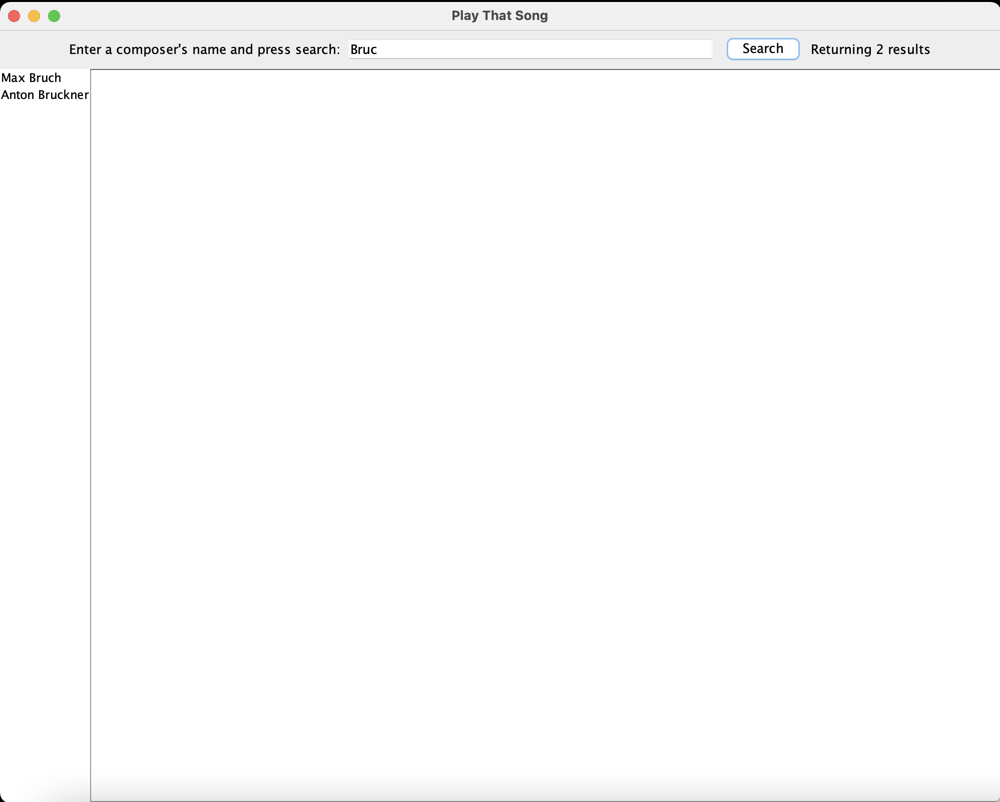
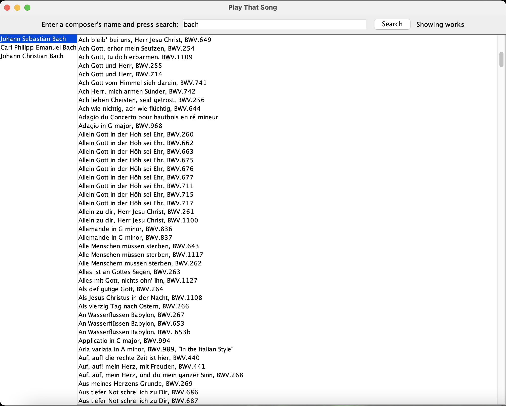

# Play That Song

This is a project that I made in my computer methodology class. It uses the OpenOpus api to allow users to look up a 
classical composer, view that composer's work, and click on a work to automatically search for it on YouTube.

This project uses the following:
- [OpenOpus api](https://openopus.org/)
- [Retrofit](https://square.github.io/retrofit/)
- [Gson](https://sites.google.com/site/gson/gson-user-guide)
- [Mockito](https://site.mockito.org/)
- [Junit](https://junit.org/junit5/) 
- [Rx](https://reactivex.io/) 
- [Gradle](https://gradle.org/)
- [Dagger 2](https://www.baeldung.com/dagger-2)

